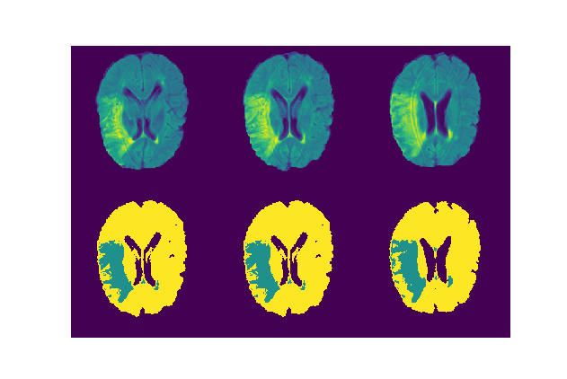
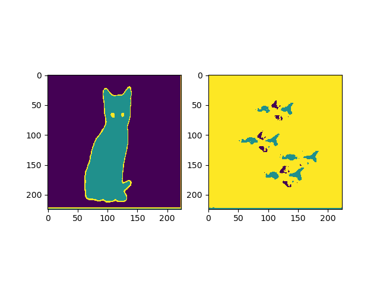

# Unsupervised brain leision segmentation

## Overview
Modify the idea presented in the paper ["Towards K-means-friendly Spaces: Simultaneous Deep Learning and Clustering"](https://arxiv.org/pdf/1610.04794) for tasks of segmentation. The trained network will take 2d images and produce segmentation masks. Number of segmentation masks has to be specified before training. The model can serve as one of the basline method for comparison with more advanced and complicated models. 

You can write your own encoder and decoder architecuters. In the visualization below, the encoder is a U-net and the decoder is a shallow fully convolutional Resnet with only 3 blocks. Proper postprocesses will certainly help improve the segmentation quality, but we did not include them here.

If you think the work is useful to you, feel free to cite this repository.

## Preprocess
Code here is tested with Flair images. Intensities are normalized by its maximum intensity per image volume to the range of [0, 1]. Slices of the volumes are used as the data for feeding the network.

## Training
`pretrain.py` is first executed to train the auto-encoder learning features for each pixel based on its neibors. An MSE error below 0.001 should be good to give not-too-bad result in the example shown below.

Following the first training, `train.py` will then be executed with an alternative training style of two phases. I, with fixed cluster centers, the auto-encoder part will be trained so that it can produces features easier for clustering as well as reconstructing the given images and II, with fixed auto-encoder, the cluster centers will be updated through a mini-batch Kmeans algorithm.

## Some visualization
The following figures shows the prediction on 3 test slices.
 

Just for fun, I trained a very small network with 6 cats rgb images and predict on another cat image and an image with planes in the sky. 
The number of masks are specified to be 3. The result looks good. It seems that the model trained on segmenting cats images are also capable of segmenting easy planes images.

